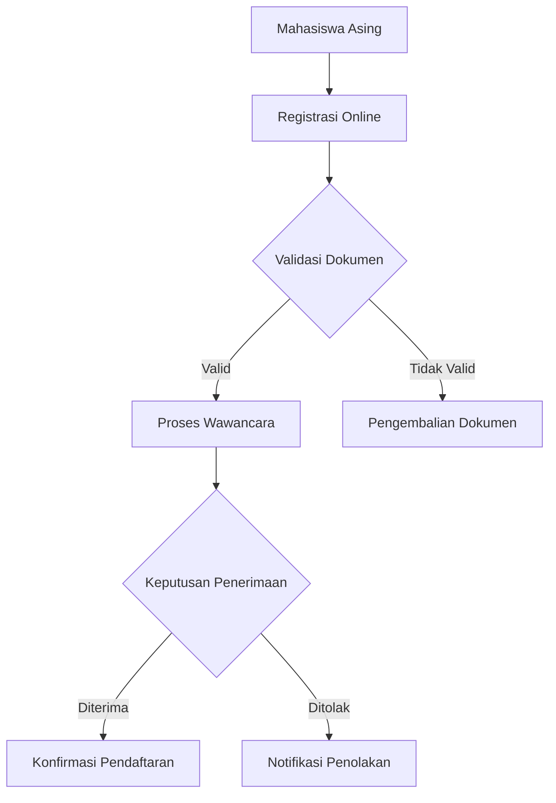

# Arsitektur Sistem Pendaftaran Mahasiswa Asing

## Gambaran Umum

Sistem ini dirancang menggunakan arsitektur microservices dengan fokus pada fleksibilitas, skalabilitas, dan kemudahan pemeliharaan.

## Komponen Utama

1. **Backend**

   - Spring Boot 3.5.3
   - Java 17
   - Camunda Zeebe 8.7.0

2. **Basis Data**

   - Hibernate ORM
   - PostgreSQL

3. **Autentikasi**

   - Spring Security
   - OAuth2
   - JWT

4. **Orkestrasi Workflow**
   - Camunda Zeebe
   - Event-Driven Architecture

## Alur Proses Bisnis

## Prinsip Desain

- Loosely Coupled
- High Cohesion
- Dependency Injection
- Stateless Services

## Teknologi Pendukung

- Docker
- Kubernetes
- Prometheus
- Grafana
- ELK Stack (Logging)

## Pertimbangan Keamanan

- Enkripsi data sensitif
- Validasi input
- Rate limiting
- CORS protection
