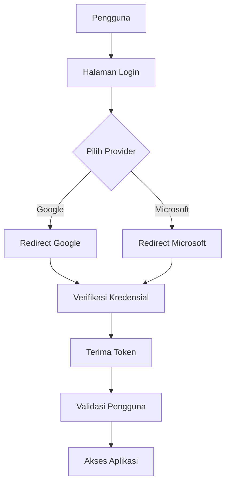

# SSO (Single Sign-On) Integration

## Metode Autentikasi

### Supported Providers

- Google
- Microsoft
- (Dapat dikembangkan untuk provider lain)

## Arsitektur

### Alur Autentikasi



## Konfigurasi

### Environment Variables

- `GOOGLE_CLIENT_ID`
- `GOOGLE_CLIENT_SECRET`
- `MICROSOFT_CLIENT_ID`
- `MICROSOFT_CLIENT_SECRET`

### Scope yang Digunakan

- Email
- Profil Dasar
- OpenID

## Keamanan

### Praktik Terbaik

- Validasi token
- Enkripsi data sensitif
- Pembatasan akses
- Logout aman

### Perlindungan

- CSRF Protection
- Rate Limiting
- Pencegahan Replay Attack

## Manajemen Pengguna

### Alur Registrasi

1. Autentikasi via Provider
2. Ekstraksi Informasi Pengguna
3. Pembuatan/Pembaruan Akun Lokal

### Atribut yang Diekstrak

- Email
- Nama
- Foto Profil
- Provider Asal

## Monitoring

### Metrik Login

- Jumlah Login per Provider
- Waktu Autentikasi
- Kegagalan Login

## Troubleshooting

### Umum

- Periksa konfigurasi
- Validasi kredensial
- Cek konektivitas

### Log

- Catat percobaan login
- Rekam kesalahan autentikasi

## Skalabilitas

### Rencana Pengembangan

- Tambah provider baru
- Implementasi Multi-Factor Authentication
- Integrasi dengan Identity Provider Enterprise

## Referensi

- OAuth 2.0 Specification
- OpenID Connect
- Spring Security OAuth

## Konfigurasi Teknis

### Spring Security

```java
@Configuration
@EnableWebSecurity
public class OAuth2LoginConfig {
    @Bean
    public SecurityFilterChain filterChain(HttpSecurity http) throws Exception {
        http
            .oauth2Login(oauth2 -> oauth2
                .loginPage("/login")
                .defaultSuccessUrl("/dashboard")
            )
            // Konfigurasi lanjutan
    }
}
```

### Konfigurasi YAML

```yaml
spring:
  security:
    oauth2:
      client:
        registration:
          google:
            client-id: ${GOOGLE_CLIENT_ID}
            client-secret: ${GOOGLE_CLIENT_SECRET}
```

## Best Practices

- Simpan token secara aman
- Gunakan environment variables
- Implementasi refresh token
- Validasi lingkup akses
