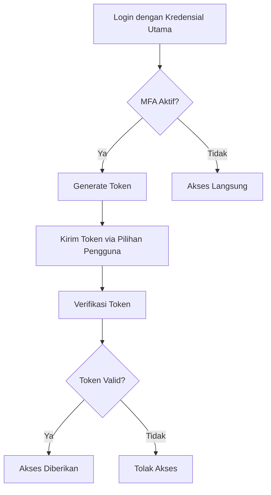

# Multi-Factor Authentication (MFA)

## Metode Autentikasi

### Opsi yang Tersedia

1. **Time-based One-Time Password (TOTP)**
   - Google Authenticator
   - Authy
2. **SMS One-Time Password**
3. **Email One-Time Password**
4. **Backup Codes**

## Arsitektur

### Komponen

- Authentication Provider
- MFA Token Generator
- Verification Service
- User Management

### Alur Kerja



## Implementasi

### Konfigurasi Spring Security

```java
@Configuration
public class MfaConfig {
    @Bean
    public MfaProvider mfaProvider() {
        return new TOTPMfaProvider();
    }
}
```

### Konfigurasi Aplikasi

```yaml
app:
  mfa:
    enabled: true
    methods:
      - TOTP
      - EMAIL
    totp:
      issuer: UniversitasGunadarma
    email:
      sender: noreply@gunadarma.ac.id
```

## Keamanan

### Praktik Terbaik

- Enkripsi token
- Batasi percobaan
- Masa berlaku token pendek
- Notifikasi perubahan

### Perlindungan

- Rate Limiting
- Pencegahan Replay Attack
- Audit Log

## Manajemen Pengguna

### Alur Registrasi MFA

1. Aktifkan MFA
2. Pilih Metode
3. Konfigurasi/Verifikasi
4. Simpan Backup Codes

### Fitur

- Ganti Metode MFA
- Nonaktifkan MFA
- Reset MFA

## Monitoring

### Metrik

- Jumlah Aktivasi MFA
- Kegagalan Autentikasi
- Waktu Verifikasi

## Integrasi

### Rencana

- Dukungan Provider Identitas
- Integrasi SSO
- Autentikator Eksternal

## Tantangan

### Yang Perlu Diperhatikan

- Kegunaan
- Beban Pengguna
- Kompatibilitas Perangkat

## Referensi

- [NIST Digital Identity Guidelines](https://pages.nist.gov/800-63-3/)
- [OWASP MFA Cheat Sheet](https://cheatsheetseries.owasp.org/cheatsheets/Multifactor_Authentication_Cheat_Sheet.html)
